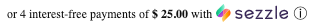
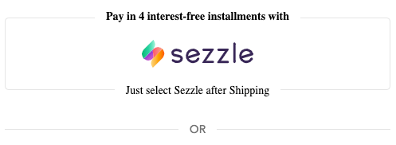
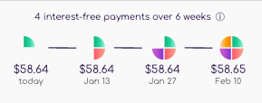
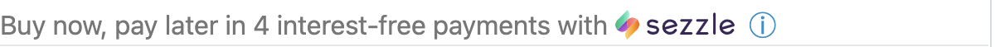

# Sezzle Simple SDK

This SDK is a simple way to include sezzle widget onto a merchant's website.
Think of it as a light version to our own `Sezzle-js`
Everything is packaged within the SDK i.e All the images, css is within the bundle.js file

What makes this SDK interesting is that it has a different approach compared to the standard Sezzle widget script. Instead of reaching out to Sezzle's widget server on page-load, all the widget code and the custom configuration is stored locally within the store theme.


## Configurations

Once the widget is rendering, additional configurations can be added to the AwesomeSezzle to change the appearance. Below is an example featuring all the options. However, amount is the only required value.

```html
 <script>
  var renderSezzle = new AwesomeSezzle({
    amount: '{{ product.selected_or_first_available_variant.price | money }}',
    renderElement: 'new-sezzle-widget-container-id',
    theme: 'light',
    maxWidth: 400,
    marginTop: 0,
    marginBottom: 0,
    marginLeft: 0,
    marginRight: 0,
    alignment: 'left',
    alignmentSwitchMinWidth: 576,
    alignmentSwitchType: 'center',
    textColor: 'black',
    fontFamily: 'Comfortaa, sans-serif',
    fontSize: 12,
    fontWeight: 400,
    widgetType: 'product-page',
    fixedHeight: 0,
    logoSize: 1.0,
    logoStyle: {},
    modalTheme:'color',
    language: 'en',
    parseMode: 'default'
  })
  renderSezzle.init();
</script>
```

1. **`amount`** - This config is required. Provide the product price variable as a template-literal,  Shopify.Liquid Example: `'{{ product.selected_or_first_available_variant.price | money }}'`
2. **`renderElement`** - This config is optional. Provide the ID name or array of ID names that correspond to the widget placeholder elements. It defaults to `sezzle-widget`.
3. **`theme`** - This config is optional. It defaults to `light`. Alternative values include `dark`, `grayscale`, `black-flat`, `white`, or `white-flat`.
4. **`modalTheme`** - This config is optional. It defaults to `color`. Alternative values include `grayscale`
5. **`maxWidth`** - This config is optional. It defaults to `400`.
6. **`marginTop`** - This config is optional. It defaults to `0`.
7. **`marginBottom`** - This config is optional. It defaults to `0`.
8. **`marginLeft`** - This config is optional. It defaults to `0`.
9. **`marginRight`** - This config is optional. It defaults to `0`.
10. **`alignment`** - This config is optional. It defaults to `left`. Alternative values include `center`, `right`, or `auto`.
11. **`alignmentSwitchMinWidth`** - This config is optional. It defaults to `760`.
12. **`alignmentSwitchType`** - This config is optional. Alternative values include `left`, `center`, or `right`.
13. **`textColor`** - This config is optional. It defaults to `#111`. Alternative values include all colors supported by CSS.
14. **`fontFamily`** - This config is optional. It defaults to `inherit`. Alternative values include all fonts supported by CSS.
15. **`fontSize`** - This config is optional. It defaults to `12` <small>in pixel</small>.
16. **`fontWeight`** - This config is optional. It defaults to `300`.
17. **`widgetType`** - This config is optional. It defaults to `product-page`. Alternative values include `product-preview` or `cart`.
18. **`fixedHeight`** - This config is optional. It defaults to `0`.
19. **`logoSize`** - This config is optional. It defaults to `1.0`.
20. **`logoStyle`** - This config is optional. It defaults to `{}`.
21. **`language`** - This config is optional. It defaults to `en`. Language value may be given as a string or function. Supported options available are `en`, `fr`, `de`, or `es`.
22. **`parseMode`** - This config is optional. It defaults to `default`. Alternative values include `comma`.
23. **`merchantLocale`** - This config is optional. It defaults to `North America`. Alternative values include `Europe` or the two-letter country code.

### <b>Please discuss with Sezzle point of contact before using the below config options:</b>
24. **`widgetTemplate`** - This config is optional. It defaults to `or 4 interest-free payments of %%price%% with %%logo%% %%info%%`. Available templates include `%%price%%`, `%%logo%%`, `%%link%%`, `%%info%%`, `%%question-mark%%`, `%%line-break%%`, `%%afterpay-logo%%`, `%%afterpay-logo-grey%%`, `%%afterpay-info-icon%%`, `%%afterpay-link-icon%%`, `%%quadpay-logo%%`, `%%quadpay-logo-grey%%`, `%%quadpay-logo-white%%`, `%%quadpay-info-icon%%`, `%%affirm-logo%%`, `%%affirm-logo-grey%%`, `%%affirm-logo-white%%`, `%%affirm-info-icon%%`, `%%klarna-logo%%`, `%%klarna-logo-grey%%`, `%%klarna-logo-white%%`, `%%klarna-info-icon%%`.
25. **`numberOfPayments`** - This config is optional. defaults to `4`.
26. **`minPrice`** - This config is optional. It defaults to `0` - <small>in cents</small>.
27. **`maxPrice`** - This config is optional. It defaults to `250000` - <small>in cents</small>.
28. **`altLightboxHTML`** - This config is optional. It defaults to our classic BNPL modal.
29. **`qpModalHTML`** -This config is optional.
30. **`apModalHTML`** - This config is optional.
31. **`apLink`** - This config is optional. It defaults to `https://www.afterpay.com/purchase-payment-agreement`.
32. **`affirmModalHTML`** - This config is optional.
33. **`klarnaModalHTML`** - This config is optional.
34. **`minPriceLT`** - This config is optional. It defaults to `0` - <small>in cents</small>.
35. **`bestAPR`** - This config is optional. It defaults to `0` - <small>in percent (ex: `4.5` = 4.5% APR)</small>.
36. **`widgetTemplateLT`** - This config is optional. It defaults to `or monthly payments as low as %%price%% with %%logo%% %%info%%`. Available templates include `%%price%%`, `%%logo%%`, `%%link%%`, `%%info%%`, `%%question-mark%%`, `%%line-break%%`.
37. **`ltAltModalHTML`** - This config is optional. It defaults to our long-term lending modal.

## Functions

1. `alterPrice(newPrice)` - Alters price on widget. Create an event listener after `renderSezzle.init()` that invokes this function where `newPrice` is the new price value of the selected variant. Example:
    ```js
      document.onchange = function(){
        var newPrice = '${yourPriceVariableHere}';
        renderSezzle.alterPrice(newPrice);
      }
    ```

2. `renderModalByfunction()` - Opens the Sezzle modal by a function. Create an event listener that invokes this function if the event location is other than the info icon.
    ```js
      var clickElement = document.querySelector('#yourClickableElementIdHere')
      clickElement.addEventListener("click", function() { renderSezzle.renderModalByfunction() });
    ```

3. `isMobileBrowser()` - Returns true on mobile browser. Use this event to show or hide the widget in different page locations based on device type.
    ```js
      document.onreadystatechange = function(){
        if(renderSezzle.isMobileBrowser()){
          document.getElementById('sezzle-widget-mobile').style.display = "block";
          document.getElementById('sezzle-widget').style.display = "none";
        } else {
          document.getElementById('sezzle-widget').style.display = "block";
          document.getElementById('sezzle-widget-mobile').style.display = "none";
        }
      }
    ```

4. `getElementToRender()` - Returns Element where the widget will be rendered. Create an event listener that invokes this function if the widget should appear when the event occurs.
    ```js
      document.body.insertBefore(renderSezzle.getElementToRender(), document.getElementById('price').nextElementSibling);
    ```

## Implementation General Overview

* Note: Implementation varies greatly by platform, theme, etc. Below is a general overview of the process. The code snippets below are <i>samples</i> and may need to be modified to fit your site.

Create a new Javascript file within your site's code where appropriate. <br/>
Copy+paste  <a href="https://github.com/sezzle/static-widgets/blob/production/dist/bundle.js">this minified code</a> into this newly created file.<br/>
Import this new file into the page(s) where the Sezzle widget will be added.<br/>
 ```html
  <script src="../scripts/sezzle-static-widget.js"></script>
 ```
Create a placeholder element where the Sezzle widget should be rendered on the page(s), usually below the price container element:<br/>
  ```html
    <div id="sezzle-widget"></div>
  ```
Add the following script below the placeholder element, updating the amount value to reflect your price variable which renders the current product price or cart total as applicable.<br/>
  ```html
    <script>
    var renderSezzle = new AwesomeSezzle({
        amount: `${yourPriceVariableHere}`
    })
    renderSezzle.init();
    </script>
  ```
Preview your changes to confirm the widget is displaying correctly.<br/>
  - Regular Price<br/>
  - Sale Price<br/>
  - Variant Selection<br/>
  - Desktop<br/>
  - Mobile<br/>

Use the Configuration options above to customize the widget appearance as desired.<br/>


## Shopify Implementation

Log into your Shopify store admin<br/>
Click Online Store > Themes<br/>
Next to the theme you wish to edit, click Actions, then select Edit Code<br/>
* Or click Customize. In the lower-left corner, click Theme Actions, then select Edit Code<br/>

Under the Assets folder, click “Add a new asset” <br/>
On the Create a Blank File tab, name it 'sezzle-static-widget’ and select “.js” as the file type, then click Add Asset<br/>
Copy the code from the below repository file and paste it into this new file, then click Save<br/>
* https://github.com/sezzle/static-widgets/blob/production/dist/bundle.js

* If bundle.js/sezzle-static-widget.js file name or type is changed in Assets folder, it needs to be updated during the next step,

Add the following lines of code wherever the widget should render on the product page within `templates/product.liquid` or `sections/product-template.liquid` as applicable:

```html
<!-- Sezzle Static Widget -->
<div id="sezzle-widget"></div>
{{ 'sezzle-static-widget.js' | asset_url | script_tag }}
<script>
  var renderSezzle = new AwesomeSezzle({
      amount: '{{ product.selected_or_first_available_variant.price | money }}'
  })
  renderSezzle.init();
  document.onchange = function(){
    var newPrice = '{{product.selected_or_first_available_variant.price | money}}';
    renderSezzle.alterPrice(newPrice);
  }
</script>
<!-- End Sezzle Static Widget -->
```

Add the following lines of code wherever the widget should render on the cart page within `templates/cart.liquid` or `sections/cart-template.liquid` as applicable:

```html
<!-- Sezzle Static Widget -->
<div id="sezzle-widget"></div>
{{ 'sezzle-static-widget.js' | asset_url | script_tag }}
<script>
  var renderSezzle = new AwesomeSezzle({
    amount: '{{ cart.total_price | money }}',
    alignment: 'right'
  })
  renderSezzle.init();
</script>
<!-- End Sezzle Static Widget -->
```

* If the ID `sezzle-widget` is changed in the div element, the new ID needs to be given in the config as `renderElement`.

## Other Products in this Project

**<a href="https://github.com/sezzle/static-widgets/blob/production/src/sezzle-shopify-buy-static-widget/sezzle-shopify-buy-static-widget.html" >Sezzle Shopify Buy Static Widget</a>**

The Sezzle Shopify Buy static widget is a lightweight version of our static widget. Shopify Buy product details are rendered within an iframe on the non-Shopify storefront, which is not compatible with either the standard widget script nor the regular static widget product.<br/>



**<a href="https://github.com/sezzle/static-widgets/blob/production/src/sezzle-checkout-button-html/sezzle-checkout-button.html" >Sezzle Shopify Checkout Button</a>**

The Sezzle Checkout button is installed on the Shopify cart page to bypass third-party checkouts such as Carthook, Zipify, or Bold Commerce by redirecting the customer to the Shopify Native checkout. Further, if a user is logged into Shop Pay but wishes to checkout with Sezzle, this button will not redirect automatically to the Shop Pay experience.<br/>


**<a href="https://github.com/sezzle/static-widgets/blob/production/src/sezzle-express-alt-banner/sezzle-express-alt-banner.html" >Sezzle Shopify Plus Express Alternative Banner</a>**

Sezzle does not offer an express checkout option at this time. This banner clarifies to the customer that Sezzle can be selected on the Payments page of the non-express checkout flow.
 - Only compatible with Shopify Plus.<br/>



**<a href="https://github.com/sezzle/static-widgets/blob/production/src/sezzle-checkout-installment-widget/sezzle-checkout-installment-widget.js" >Sezzle Checkout Installment Widget</a>**

The Sezzle Checkout Installment Widget presents a payment pie and installment schedule at checkout below the Sezzle payment option. This product is compatible with multiple platforms, provided the merchant account has access to edit the checkout page (for example, Shopify merchants must be on Shopify Plus).
 - This product has a direct integration with the Sezzle WooCommerce extension.<br/>



**<a href="https://github.com/sezzle/static-widgets/blob/production/src/abandoned-cart-email-widget/abandoned-cart-email-widget.html" >Sezzle abandoned cart email widget</a>**

The Sezzle abandoned cart email widget is a lightweight version of our static widget.It suggests the merchants to use Sezzle widget in their brand’s email footers and abandoned cart emails.It is mainly self-contained widget version for implementation without connection to Sezzle’s server, which can be copied to the merchant theme via Github.<br/>


